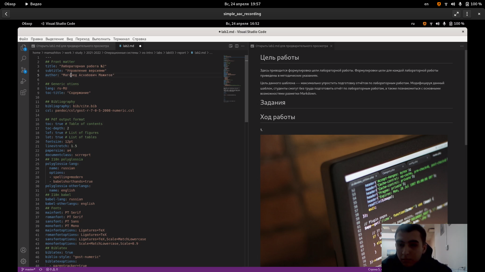
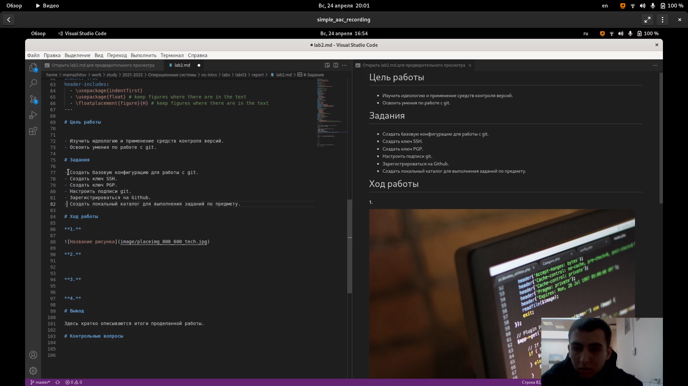
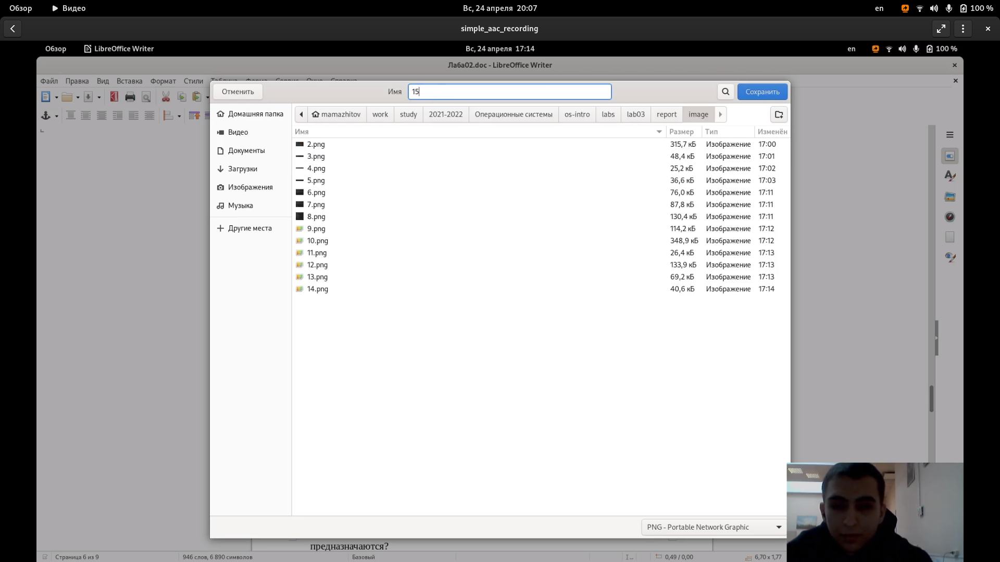
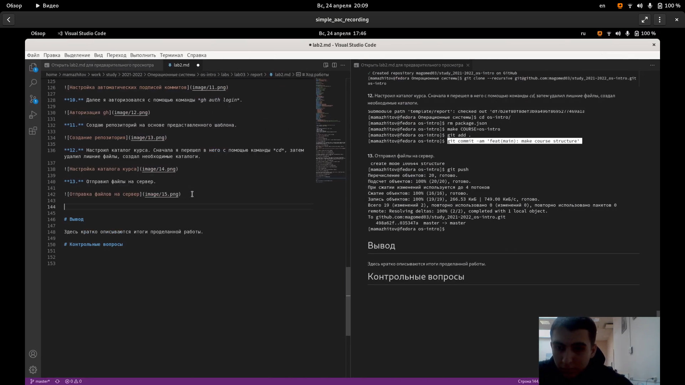
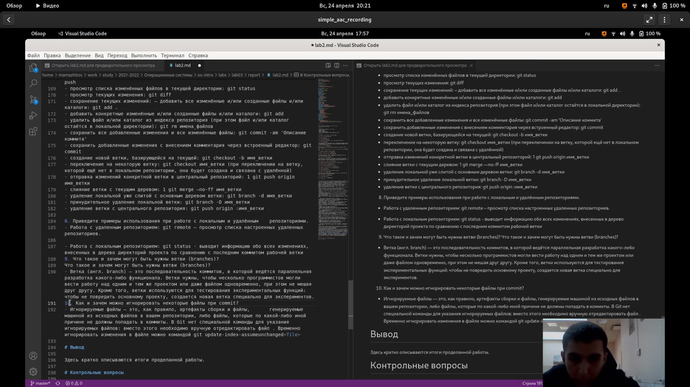
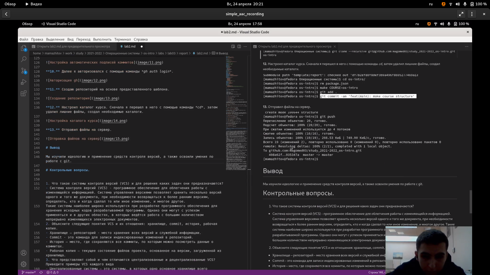

---
## Front matter
lang: ru-RU
title: Лабораторная работа №3 "Markdown"
author: Мажитов М.А.
institute: RUDN University, Moscow, Russian Federation
date:

## Formatting
toc: false
slide_level: 2
theme: metropolis
header-includes: 
 - \metroset{progressbar=frametitle,sectionpage=progressbar,numbering=fraction}
 - '\makeatletter'
 - '\beamer@ignorenonframefalse'
 - '\makeatother'
aspectratio: 43
section-titles: true
---

## Цель работы:

Научиться оформлять отчёты с помощью легковесного языка разметки Markdown.

---

## Задачи:

- Сохранить все скриншоты из отчета для лабораторной работы №2
- Сделать отчёт по предыдущей лабораторной работе в формате Markdown.

- - -

## Базовые сведения о Markdown:

Чтобы создать заголовок, используйте знак ( # ), например:

```
1. # This is heading 1
2. ## This is heading 2
3. ### This is heading 3
4. #### This is heading 4
```
Чтобы задать для текста полужирное начертание, заключите его в двойные звездочки:
```This text is **bold**.```

---


Чтобы задать для текста курсивное начертание, заключите его в одинарные звездочки:

``` This text is *italic*.```

Чтобы задать для текста полужирное и курсивное начертание, заключите его в тройные звездочки:
```This is text is both ***bold and italic***.```

Блоки цитирования создаются с помощью символа ">"

---

## Ход работы

**1.** Открыл шаблон отчета и заполнил титульный лист(рис. [-@fig:001])

{ #fig:001 width=70% }

- - - 

## Ход работы

Расписал цель работы и задания(рис. [-@fig:002])

{ #fig:002 width=70% }

- - -

## Ход работы

Сохранил все скриншоты из отчета в формате *doc* в папку *image*(рис. [-@fig:003])

{ #fig:003 width=70% }

- - -

## Ход работы

Заполнил ход работы(рис. [-@fig:004])

{ #fig:004 width=70% }

- - -

##  Ход работы

Скопировал контрольные вопросы и ответы на них из отчета(рис. [-@fig:005])

{ #fig:005 width=70% }

- - -

## Ход работы

Записал вывод.(рис. [-@fig:006])

{ #fig:006 width=70% }

- - -

## Вывод

Мы научились оформлять отчёты с помощью легковесного языка разметки Markdown.