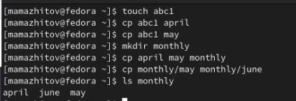
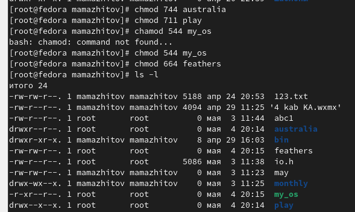
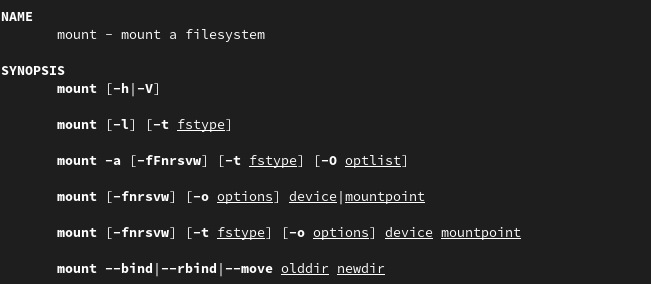

---
## Front matter
lang: ru-RU
title: Лабораторная работы №5 "Анализ файловой системы Linux. Команды для работы с файлами и каталогами"
author: Мажитов М.А.
institute: RUDN University, Moscow, Russian Federation
date:
## Formatting
toc: false
slide_level: 2
theme: metropolis
header-includes: 
 - \metroset{progressbar=frametitle,sectionpage=progressbar,numbering=fraction}
 - '\makeatletter'
 - '\beamer@ignorenonframefalse'
 - '\makeatother'
aspectratio: 43
section-titles: true
---

## Цель работы:

Ознакомление с файловой системой Linux, её структурой, именами и содержанием
каталогов. Приобретение практических навыков по применению команд для работы
с файлами и каталогами, по управлению процессами (и работами), по проверке использования диска и обслуживанию файловой системы.

---

## Задачи:

1. Выполните все примеры, приведённые в первой части описания лабораторной работы.
2. Выполните следующие действия, зафиксировав в отчёте по лабораторной работе
используемые при этом команды и результаты их выполнения:
  - Скопируйте файл /usr/include/sys/io.h в домашний каталог и назовите его
    equipment. Если файла io.h нет, то используйте любой другой файл в каталоге
    /usr/include/sys/ вместо него.
  - В домашнем каталоге создайте директорию ~/ski.plases.
  - Переместите файл equipment в каталог /ski.plases.

---

## Задачи

  - Переименуйте файл /ski.plases/equipment в /ski.plases/equiplist.
  - Создайте в домашнем каталоге файл abc1 и скопируйте его в каталог /ski.plases, назовите его equiplist2.
  - Создайте каталог с именем equipment в каталоге ~/ ski.plases.
  - Переместите файлы /ski.plases/equiplist и equiplist2 в каталог /ski.plases/equipment.
  - Создайте и переместите каталог /newdir в каталог /ski.plases и назовите
  его plans. 

---

## Задачи

3. Определите опции команды chmod, необходимые для того, чтобы присвоить перечисленным ниже файлам выделенные права доступа, считая, что в начале таких прав
нет:
  - drwxr--r-- ... australia
  - drwx--x--x ... play
  - -r-xr--r-- ... my_os
  - -rw-rw-r-- ... feathers
При необходимости создайте нужные файлы.

- - -

## Задачи

4. Проделайте приведённые ниже упражнения, записывая в отчёт по лабораторной
работе используемые при этом команды:
  - Просмотрите содержимое файла /etc/password.
  - Скопируйте файл /feathers в файл /file.old.
  - Переместите файл /file.old в каталог /play.
  - Скопируйте каталог /play в каталог /fun.
  - Переместите каталог /fun в каталог /play и назовите его games.
  - Лишите владельца файла /feathers права на чтение.
  - Что произойдёт, если вы попытаетесь просмотреть файл /feathers командой
  cat?
  - Что произойдёт, если вы попытаетесь скопировать файл /feathers?

---

## Задачи

  - Дайте владельцу файла /feathers право на чтение.
  - Лишите владельца каталога /play права на выполнение.
  - Перейдите в каталог /play. Что произошло?
  - Дайте владельцу каталога /play право на выполнение.
5. Прочитайте man по командам mount, fsck, mkfs, kill и кратко их охарактеризуйте,
приведя примеры.

---

## Ход работы

Выполнил все примеры, приведенные в первой части описания лабораторной работы.(рис. [-@fig:001;-@fig:002;-@fig:003])

---

{ #fig:001 width=70% }

{ #fig:002 width=70% }

{ #fig:003 width=70% }

---

## Ход работы

Скопировал файл /usr/include/sys/io.h в домашний каталог и назвал его equipment.(рис. [-@fig:004])

{ #fig:004 width=70% }

---

## Ход работы

В домашнем каталоге создал директорию ~/ski.plases.(рис. [-@fig:005])

{ #fig:005 width=70% }

---

## Ход работы

Переместил файл equipment в каталог ~/ski.plases и переименовал его в equiplist2.(рис. [-@fig:006])

{ #fig:006 width=70% }

---

## Ход работы

Создал в домашнем каталоге файл abc1, скопировал его в каталог ~/ski.plases и назвал его equiplist2.(рис. [-@fig:007])

{ #fig:007 width=70% }

---

## Ход работы

Создал каталог с именем equipment в каталоге /ski.plases. Переместил файлы /ski.plases/equiplist и equiplist2 в каталог /ski.plases/equipment.(рис. [-@fig:008])

{ #fig:008 width=70% }

---

## Ход работы

Создал и переместил каталог /newdir в каталог /ski.plases и назвал его plans.(рис. [-@fig:009])

{ #fig:009 width=70% }

---

## Ход работы

Создал необходимые файлы и каталоги.(рис. [-@fig:010;-@fig:011])

{ #fig:010 width=70% }

{ #fig:011 width=70% }

---

## Ход работы

Присвоил каталогам и файлам права, указанные в задании.(рис. [-@fig:012])

{ #fig:012 width=70% }

---

## Ход работы

 Просмотрел содержимое файла /etc/passwd с помощью cat.(рис. [-@fig:013])

---

{ #fig:013 width=70% }

---

## Ход работы

 Скопировал файл /feathers в файл /file.old и переместил file.old в каталог /play. (рис. [-@fig:014])

{ #fig:014 width=70% }

---

## Ход работы

Скопировал каталог /play в каталог /fun.(рис. [-@fig:015])

{ #fig:015 width=70% }

---

## Ход работы

 Переместил каталог /fun в каталог /play и переименовал его games, однако он почему-то оказался в домашнем каталоге. Тогда я просто переместил его в play.(рис. [-@fig:016])

{ #fig:016 width=70% }

---

## Ход работы

Лишил владельца файла ~/feathers права на чтение, попытался его прочитать, но ничего не произошло. Затем я вернул право на чтение владельцу.(рис. [-@fig:017])

{ #fig:017 width=70% }

---

## Ход работы

Лишил владельца каталога /play права на выполнение и попробовал перейти в него(удачно).(рис. [-@fig:018])

{ #fig:018 width=70% }

---

## Ход работы

Вернул владельцу право на выполнение каталога *play*. (рис. [-@fig:019])

{ #fig:019 width=70% }

---

## Ход работы

Прочитал man по командам mount, fsck, mkfs, kill(в скринкасте охаратеризовал их).(рис. [-@fig:020;-@fig:021;-@fig:022;-@fig:023])

{ #fig:020 width=70% }

---

{ #fig:021 width=70% }

---

{ #fig:022 width=70% }

---

{ #fig:023 width=70% }

---

## Вывод

Мы приобрели практические навыки по применению команд для работы
с файлами и каталогами, по управлению процессами (и работами), по проверке использования диска и обслуживанию файловой системы.
